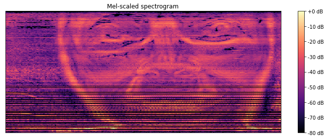

<h1 align="center"> 🎶 Custom Shazam </h1>

> Original paper: https://www.ee.columbia.edu/~dpwe/papers/Wang03-shazam.pdf

### Usage 

Install the requirements. We recommend to set an environment for isolation. Once inside the notebook you will find instructions for every step: downloading, plotting or generating the hash.

```bash
python3 -m venv env   
source env/bin/activate
pip install -r requirements.lock
python -m ipykernel install --user --name=myenv
jupyter notebook custom_shazam.ipynb
```

## How it works? The algorithm

Shazam is based on fingerprinting the audio using its frequencies. The main idea is that we have a database with digital summaries for each song. We use those summaries to search for matches when a user wants to identify a song. 

To work with frequencies we use the **DFT** (Discrete Fourier Transform) which turns data from time domain into frequency domain:


In this formula:

- N is the size of the window (number of samples that composed the signal)

- X(n) represents the nth bin of frequencies

  - the bin resolution equals to the sampling rate divided by the size of the window 
- x(k) is the kth sample of the audio signal

Note that there is the concept of window, this is used because if we transform the data info the frequency domain we loose all the information about time. To maintain some information we take chunks of data (using this sliding window) and transform that part. Then we know the mangnitude of frequencies that happen during that fragment of time. 


<div align="center">

  <br>
  Spectogram of <a href="https://www.youtube.com/watch?v=M9xMuPWAZW8&t=330s">Equation by Aphex Twin around minute 5:30</a>
</div>


More concretely, we will use the **FFT** (Fast Fourier Transform).  Why?

Imagine that we want to process a three-minutes song at 44,1 kHz, computed with a 4096-sample window. With the original DFT we would have to compute 10.7 (44100/4096) DFT per second and each DFT needs 2*4096^2 operations, so in total 6.5 * 10^10, that would take days/monts to process. FFT requires 340 times less additions (1.43 * 10^11).

**FFT computed using divide and conquer** (source Wikipedia)

```python
from cmath import *
def fft(x):
        N=len(x)
        if N==1: return x
 
        even=fft([x[k] for k in range(0,N,2)])
        odd= fft([x[k] for k in range(1,N,2)])
 
        M=N/2
        l=[ even[k] + exp(-2j*pi*k/N)*odd[k] for k in range(M) ]
        r=[ even[k] - exp(-2j*pi*k/N)*odd[k] for k in range(M) ]
 
        return l+r
```


### Steps:


1. THe 44.1 kHz sampled sound is passed from stereo to mono i.e. averaging both channels

2. Filter frequencies above 5kHz to avoid aliasing and then downsapling. 

3. Apply window function (to decrease samples) and then FFT for every sample. Then we get a spectogram:


4. We filter out the lowest notes because Shazam needs to be noise tolerant. More concretely, we keep the peaks of energy in the spectrum that represent the loudest notes:

   

5. These key points are saved as a hash. Those hash values will be used in order to match the songs requested. 


   


